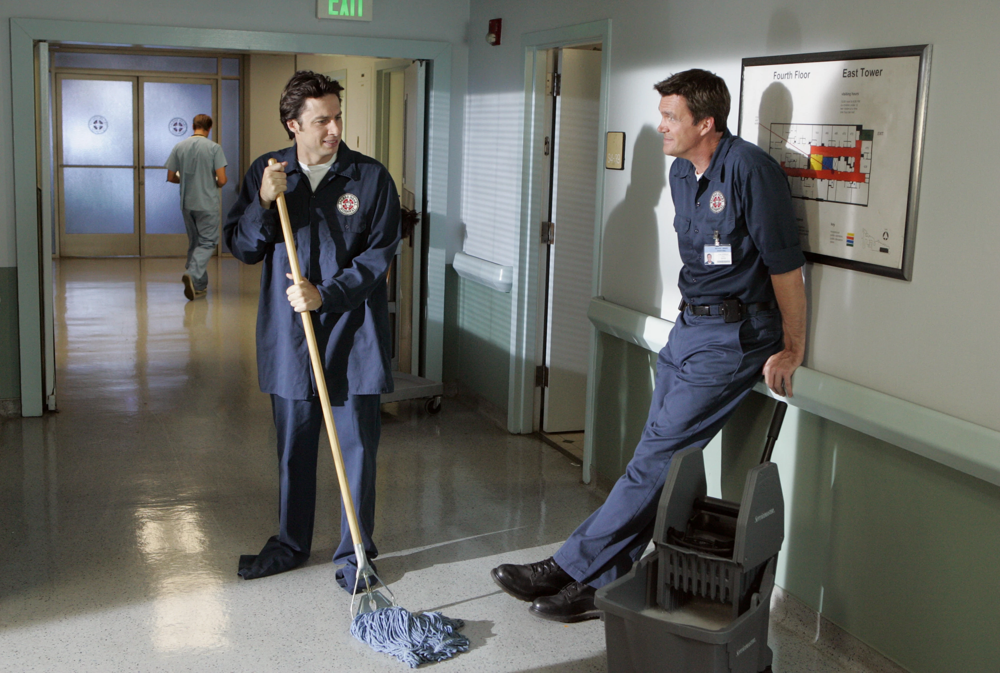

# about

I'm a bioinformatics data engineer working in Melbourne, Australia. I started
out as a bioinformatics research assistant working on a rapidly-growing dataset
that required me to learn more about data engineering best-practices to make our
data lifecycle more manageable.

The data engineering aspect of bioinformatics is often overlooked as it may not
be as exciting as the biology involved. But as our datasets grow in size,
it is important for us to consider how to more effectively manage that data and
to borrow and learn from data engineering practices in other industries.

I started this site to document interesting problems and useful solutions I've
encountered through my work.

